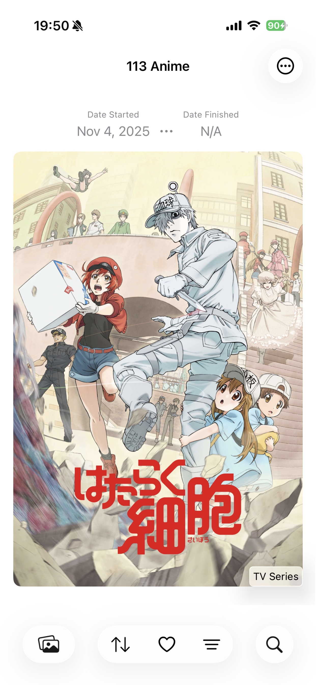
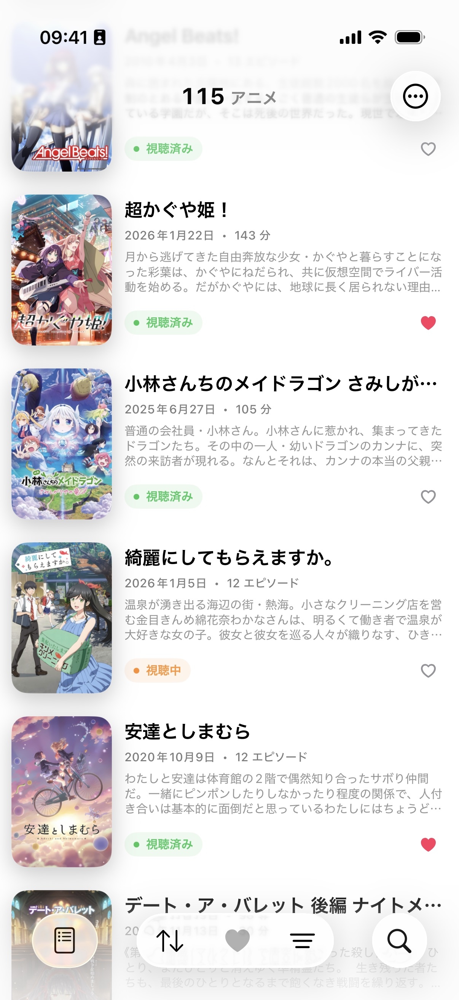
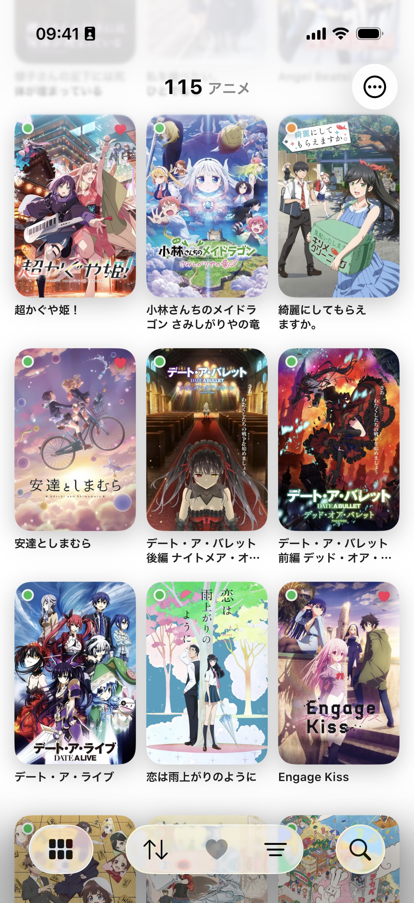
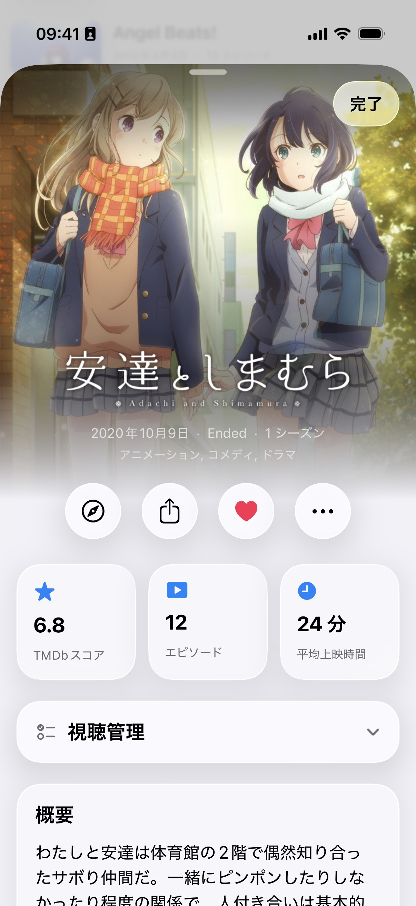
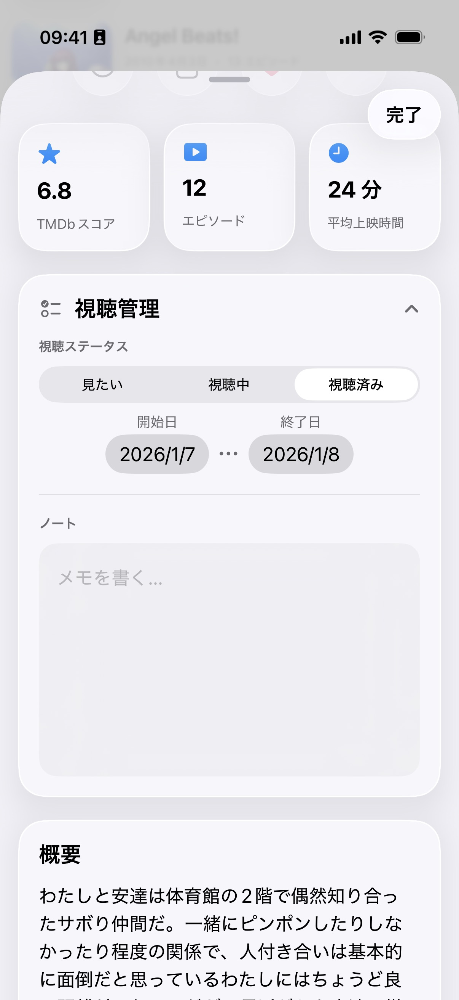

# AniShelf 📺

A beautiful, native iOS app for tracking and managing your anime library.

## 📸 Screenshots

<div style="overflow-x: auto; padding: 0.25rem 0 1rem;">
  <table cellpadding="0" cellspacing="12">
    <tr>
      <td></td>
      <td></td>
      <td></td>
      <td></td>
      <td></td>
    </tr>
  </table>
</div>

## ✨ Features

- **📚 Library Management** - Keep track of all your anime in one place
- **🔍 Smart Search** - Find anime using The Movie Database (TMDb) with multi-language support
- **🎨 Beautiful UI** - Native SwiftUI interface with multiple viewing modes:
  - Grid View - Visual poster grid
  - List View - Detailed list layout
  - Gallery View - Immersive full-screen browsing
- **📊 Track Progress** - Monitor your viewing progress and status
- **💾 Backup & Restore** - Export and import your library data
- **🌍 Multi-language** - Support for anime titles and descriptions in multiple languages

## 🧪 TestFlight Beta

Join the latest beta build here:

- [AniShelf TestFlight](https://testflight.apple.com/join/ns3sR38X)

> You still need a TMDb API key to use the app, which can be obtained for free from [The Movie Database](https://www.themoviedb.org/settings/api).

## 🛠 Tech Stack

- **Swift 6.1+** with strict concurrency
- **SwiftUI** for modern, declarative UI
- **SwiftData** for data persistence
- **TMDb API** integration for anime metadata
- **Kingfisher** for efficient image loading and caching

## 📋 Build Requirements

- iOS 26.0+
- Xcode 26.0+
- Swift 6.1+
- TMDb API key (free from [The Movie Database](https://www.themoviedb.org/settings/api))

## 🚀 Getting Started

1. **Clone the repository**

   ```bash
   git clone https://github.com/yourusername/AniShelf.git
   cd AniShelf
   ```

2. **Open in Xcode**

   ```bash
   open MyAnimeList.xcodeproj
   ```

3. **Build and run**
   - Select your target device or simulator
   - Press `⌘R` to build and run
   - On first launch, you'll be prompted to enter your TMDb API key

## 🔧 Development

### Build Commands

```bash
# Clean build artifacts
make clean

# Refresh Swift package dependencies
make refresh-packages

# Format code
make format

# Lint code
make lint
```

### Project Structure

> **Note:** The app was renamed from **MyAnimeList** to **AniShelf**. Only the display name and the top-level repository folder were changed; internal directory and file names still use `MyAnimeList` for simplicity and backward compatibility.

- `MyAnimeList/` - Main iOS/macOS application
- `DataProvider/` - SwiftData persistence layer (Swift Package)

For detailed architecture and development guidelines, see [AGENTS.md](AGENTS.md).

## 🤝 Contributing

Contributions are welcome! Please feel free to submit a Pull Request.

### Commit Message Guidelines

This project follows conventional commit message format:

- Use imperative mood ("Add feature" not "Added feature")
- Capitalize the first letter
- Keep subject line under 50 characters
- Add detailed body if needed (wrap at 72 characters)

Examples:

```git
Add Library search functionality to SearchPage

Fix bug in backup & restore function

Refactor Library views to reduce duplicate code
```

## 📝 License

This project is licensed under the Apache License 2.0 - see the [LICENSE](LICENSE) file for details.

## 🙏 Acknowledgments

- [The Movie Database (TMDb)](https://www.themoviedb.org/) for their comprehensive anime database
- [Kingfisher](https://github.com/onevcat/Kingfisher) for image loading and caching

---

**Built with ❤️ using Swift and SwiftUI**
