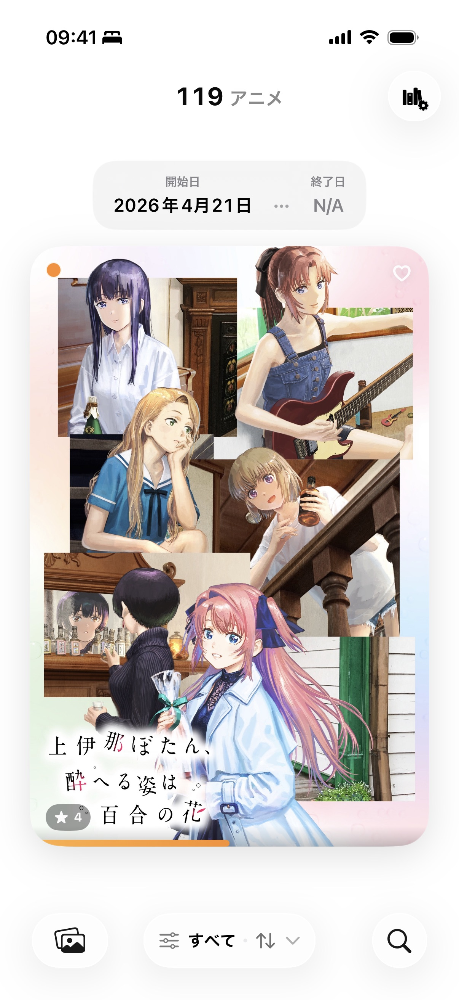
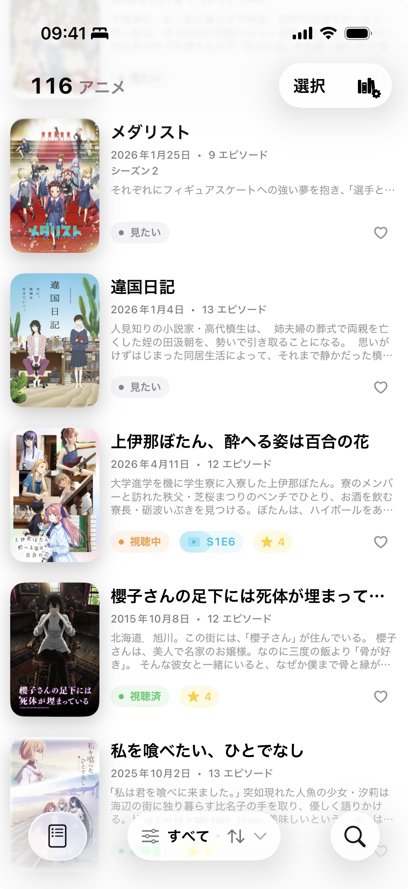
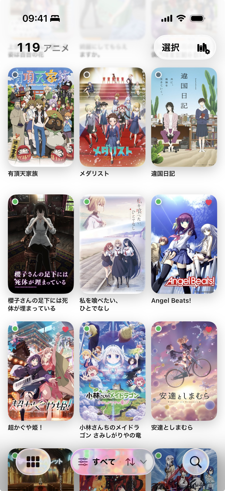
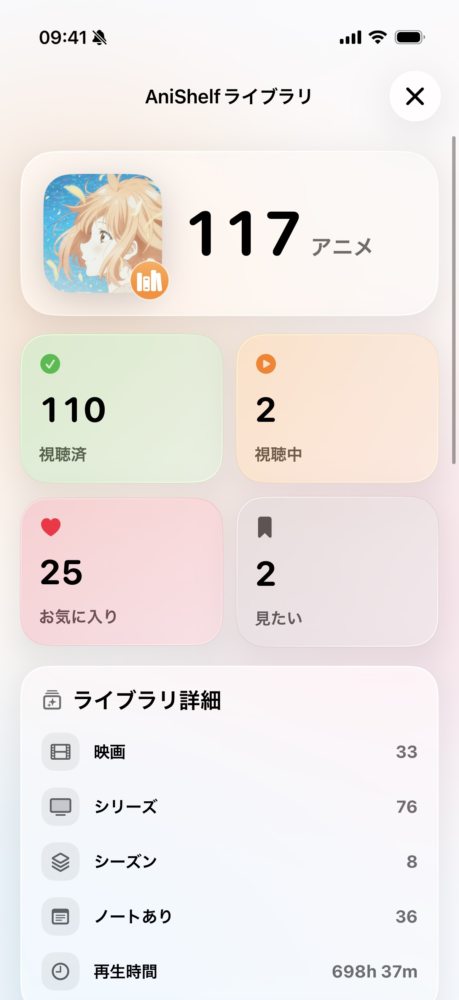

# AniShelf 📺

一个美观的原生 iOS 应用，用来追踪和管理你的动画资料库。

[English](README.md) · [使用教程](docs/anishelf_overview.md)

## 📸 截图

<div style="overflow-x: auto; padding: 0.25rem 0 1rem;">
  <table cellpadding="0" cellspacing="12">
    <tr>
      <td></td>
      <td></td>
      <td></td>
    </tr>
    <tr>
      <td></td>
      <td></td>
      <td></td>
    </tr>
  </table>
</div>

## ✨ 功能

- 从 TMDb 获取番剧/动画电影数据，展示在 App 内。
- 用户可以添加番剧/动画电影到资料库，记录观看状态
  - 未看、在看、已看、搁置
  - 起止日期
- 记录感想
- 获取每集的摘要、声优等信息
- 查看番剧/动画电影在 TMDb 上的评分
- 精美的 UI 设计、流畅的交互体验

## 🧪 TestFlight Beta

在这里加入最新 Beta 版本：

- [AniShelf TestFlight](https://testflight.apple.com/join/ns3sR38X)

> 使用应用仍然需要 TMDb API key，可以从 [The Movie Database](https://www.themoviedb.org/settings/api) 免费获取。

## 🛠 技术栈

- **Swift 6.1+**
- **SwiftUI**
- **SwiftData**
- **TMDb API**
- **Kingfisher**

## 🗺 计划

- 更细的观看进度记录，例如精确到集
- 更细的评分机制；目前只有普通/特别收藏，后续考虑添加星级评分
- 批量导入功能
- 与 TMDb、Bangumi、AniList 等平台的观看数据同步功能；这个比较复杂，可能会比较晚再做

## 📋 Build/Run Requirements

- iOS 26.0+
- Xcode 26.0+
- Swift 6.1+
- TMDb API key (free from [The Movie Database](https://www.themoviedb.org/settings/api))

## 🚀 Getting Started

1. **Clone the repository**

   ```bash
   git clone https://github.com/samuelhe52/AniShelf.git
   cd AniShelf
   ```

2. **Open in Xcode**

   ```bash
   open MyAnimeList.xcodeproj
   ```

3. **Build and run**
   - Select your target device or simulator
   - Press `⌘R` to build and run
   - On first launch, you'll be prompted to enter your TMDb API key

## 🔧 Development

### Build Commands

```bash
# Clean build artifacts
make clean

# Refresh Swift package dependencies
make refresh-packages

# Format code
make format

# Lint code
make lint

# Build, install, and launch on a connected iPhone
make run-device

# Reset the TMDb API key before launching on a connected iPhone
make run-device-reset-tmdb-api-key
```

### Project Structure

> **Note:** The app was renamed from **MyAnimeList** to **AniShelf**. Only the display name and the top-level repository folder were changed; internal directory and file names still use `MyAnimeList` for simplicity and backward compatibility.

- `MyAnimeList/` - Main iOS application
- `DataProvider/` - SwiftData persistence layer (Swift Package)

For detailed architecture and development guidelines, see [AGENTS.md](AGENTS.md).

## 🤝 Contributing

Contributions are welcome! Please feel free to submit a Pull Request.

### Commit Message Guidelines

This project follows conventional commit message format:

- Use imperative mood ("Add feature" not "Added feature")
- Capitalize the first letter
- Keep subject line under 50 characters
- Add detailed body if needed (wrap at 72 characters)

Examples:

```git
Add Library search functionality to SearchPage

Fix bug in backup & restore function

Refactor Library views to reduce duplicate code
```

## 📝 License

This project is licensed under the Apache License 2.0 - see the [LICENSE](LICENSE) file for details.

## 🙏 Acknowledgments

- [The Movie Database (TMDb)](https://www.themoviedb.org/) for their comprehensive anime database
- [Kingfisher](https://github.com/onevcat/Kingfisher) for image loading and caching

---

**Built with ❤️ using Swift and SwiftUI**
